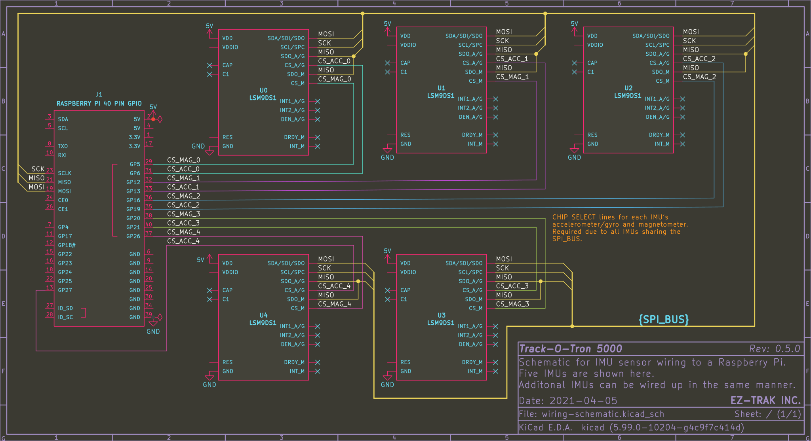

# Track-O-Tron
Track-O-Tron is a full-body VR tracking solution that uses LSM9DS1 Inertial Measurement Units (IMUs) integrated into clothing for inside-out full-body tracking.

This project was created as a Semester Long Design Project for NYU Tandon's EG-1003 course.

## Requirements
- [PlatformIO](https://platformio.org/platformio-ide) for compiling the Arduino code
- CMake for compiling the PC code

## Building
### PlatformIO (Arduino)
Enter the platformio/ subdirectory and open it in your PlatformIO IDE of choice, or build it using the PlatformIO CLI.

## Circuit Wiring


Connect each IMU's SPI pins to the hardware SPI pins on your microcontroller (pins 50, 51, and 52 for the Arduino Mega pictured above).
All IMUs share a single SPI bus, so all MOSI pins from every IMU will be connected together, and likewise for all MISO pins.
_Note that there are two MISO pins on LSM9DS1s for accel/gyro and mag, **both** of these lines will be connected together!_

In order for multiple peripherals to share an SPI bus like this, Chip Select (CS) lines are controlled by the MCU, so that only one IMU at a time will be communicating over SPI.
Connect each IMU's seperate accelerometer/gyroscope and magnetometer CS pins to their own digital pin on the MCU.

Make sure to update the ['imus' array in platformIO/src/main.cpp](platformio/src/main.cpp#L19) to match which CS pins you are using! 
The CS pin order is `{accel_cs_pin_, mag_cs_pin}`. 
So the array for the schematic above looks like this:

```c++
LSM imus[] = {
    {28, 27}, // IMU 0, which could be e.g. forearm_r
    {30, 29}, // IMU 1, which could be e.g. forearm_l
    {32, 31}, // IMU 2
    {34, 33}, // IMU 3
    {36, 35}  // IMU 4
};
```

See LSM9DS1 module documentation from [Adafruit](https://learn.adafruit.com/adafruit-lsm9ds1-accelerometer-plus-gyro-plus-magnetometer-9-dof-breakout/pinouts#spi-pins-2197900-7) and [Sparkfun](https://learn.sparkfun.com/tutorials/lsm9ds1-breakout-hookup-guide/all#hardware-hookup) for more details.

