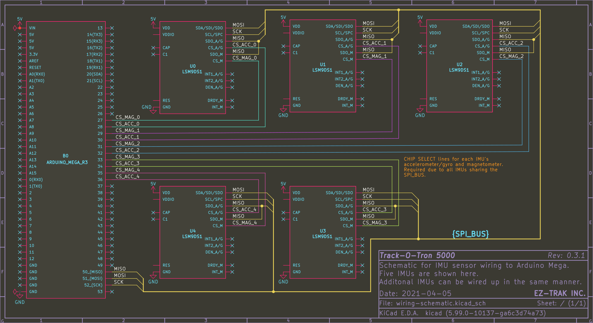

# Track-O-Tron
Track-O-Tron is a full-body VR tracking solution that uses Inertial Measurement Units (IMUs) worn by the user.

This project was created as a Semester Long Design Project for NYU Tandon's EG-1003 course.

## Requirements
- [PlatformIO](https://platformio.org/platformio-ide) for compiling the Arduino code
- CMake for compiling the PC code

## Building
### PlatformIO (Arduino)
Enter the platformio/ subdirectory and open it in your PlatformIO IDE of choice, or build it using the PlatformIO CLI.

## Circuit Wiring

Connect each IMU's SPI pins to the hardware SPI pins on your microcontroller (pins 50, 51, and 52 for the Arduino Mega pictured above), and connect the accelerometer and magnetometer Chip Select (CS) pins to any digital pins. 
See [Adafruit's LSM9DS1 documentation](https://learn.adafruit.com/adafruit-lsm9ds1-accelerometer-plus-gyro-plus-magnetometer-9-dof-breakout/pinouts#spi-pins-2197900-7) for details.

Make sure to update the ['imus' array in platformIO/src/main.cpp](platformio/src/main.cpp#L19) to match which CS pins you are using! 
The CS pin order is {_accel\_cs\_pin_, _mag\_cs\_pin_}. 
